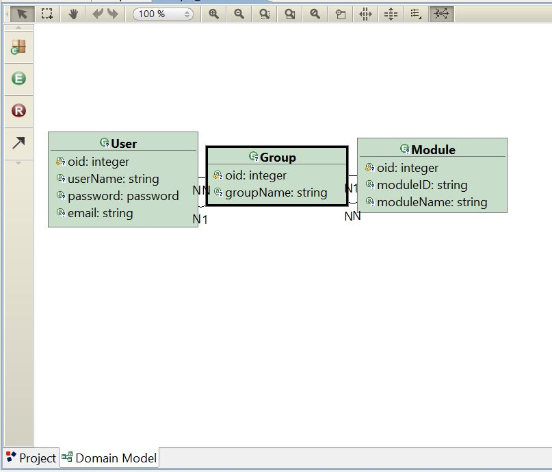

## WebRatio voting web application tutorial

This is a detailed, step-by-step tutorial for creating a simple web application with Model Driven Development using the WebRatio platform.

This tutorial should work for Windows users, but as of today we have not been able to run WebRatio on Mac.

The final application that will be made in this tutorial is also available in this repository.

---
1. **Setup**
    - Download the WebRatio Web Platform Community Edition for windows: https://www.webratio.com/site/content/en/editions#wr-web-platform
        - There is a requirement of an account on WebRatio to download and login when opening the program for the first time
    - Run the *.exe* file to install, then open the program when it is done

2. **Project Setup**
    - Click on *File* -> *New* -> *Web project* to create a new project
        - Give the project a name (like *Expo*)
        - Should now have new project with a *Model.wr* file and domain model looking like this:
     
    - Right click in *outline* window, go to *add* and then select *Database* to create a new database
    - Click on the database and go to the *properties window* (bottom left)
        - Select type: *Apache derby*
        - Add to URL: jdbc:derby://localhost:50124/*Your_DB_Name_Here*;create=true
        - Add "admin" as username and password
!(screenshots/DBProperties.JPG) 

3. **Create domain model**
    **NB! The naming in this part is crucial if we want to avoid having to make changes to the SQL script manually**
    - Navigate to the *Domain model* window
        - Click on *Entity* and add a new entity (green circle with an *E* inside)
        - Call the new entity *Exhibit*
        - Right click on *Exhibit* entity -> *add* -> *attribute* and add a new attribute called "name" of type string
        - Click on *Relationship* and add a new relationship between *Exhibit* and *User* (brown circle with an R inside)
    - Repeat above steps to create a new entity called *Rating* with an attribute "score" of type float and
         a relationship between *Exhibit* and *Rating*

The resulting domain model should look something like this:
!(screenshots/DomainModelFinal.JPG)

4. **Initialize Database**
    - Right click on your database and click on *Synchronize* 
        - Choose select *App* as schemata and hit *Next*
        - Click on *Export all objects* (rightmost button above window) and hit *Next*
        - Now you have created a SQL script for initializing the DB, make sure *Save and execute* is checked and hit finish
        - Should now be able to expand the database in the *Outline* window to view metadata
    - Download or copy *data.sql* from the repository (above)
        - Right click on database and select *Execute SQL*
        - Locate the *data.sql* file and hit *OK*
        - Terminal window at the bottom should say *SQL SCRIPT SUCCESSFULLY EXECUTED*
        - Now we have populated the DB with some dummydata

5. **Create basic view model:** Simple site for viewing the exhibits stored in our DB
    - Click on the *Project* tab to bring up the project in the *Outline* window
    - Right click on *Web Model* and select *Site View* and call it "View" \
**All the different components for creating model can also be found in the toolbar on the left side of the window**
    - Add area: Right click in *View* window -> *Add* -> *Area* and call it "Expo"
    - Add homepage: Inside *Area*, right click -> *Add* -> *Page* and call it "Home"
    - Add exhibit list: Inside *Home* page, right click -> *Add view components* -> *List* and call it "Exhibits"
        - In properties window: locate *Entity*, click select, and choose *Exhibit*
        - In properties window: locate *Display Attributes*, click on select and check *Name*

This is what the view model should look like:
!(screenshots/BasicView.JPG)

Now that we have created a view for our application, we can run the program before continuing, to view our list of exhibits.
To run the application: Right click in outline window -> *Generate* -> *Generate and Run* (the first execution will be slow).
A tomcat server terminal window will pop up, before the webpage automatically pops up at the homepage of our application (default port 8080).\
To stop the application, simply close the tomcat terminal window.

This is what it should look like:
!(screenshots/HomePageInital.JPG)

6. **Create more advanced system for voting on exhibits**
    - Add new page in *Expo* area -> *Add* -> *Page* and call it *Exhibit*
    - Create exhibit details: Right click in *Exhibit* page -> *Add view components* -> *Details* and call it "Exhibit"
        - Properties: Add entity *Exhibit*
    - Create a data flow from *Exhibits* list to *Details*: Right click on *Exhibits* list -> *Add* -> *Flow* and then click on details
        - Properties: Add name *Details*
    - Create voting form: Right click in *Exhibit* page -> *Add view components* -> *Form* and call it "Vote"
        - Properties: Add entity *Rating*
        - Right click on form -> *Entity fields wizard*, make sure only *score* is checked and click *Finish*
    - Create flow from *Details* to *Vote* (like flow above)
        - Properties: In binding: *Open parameter binding dialog*, uncheck *Enable default binding*, go to tab *Passing* and check *oid*
    -  Create Database operation: Right click in *Expo* area -> *Add operation* -> *Change* and name it "AddVote"
        - Properties: Add entity *Rating*
    - Create flow from *Vote* to *AddVote* (like flow above)
        - Properties: Give it the name "Vote" 
        In binding: *Open parameter binding dialog*, uncheck *Enable default binding*, and in *source* select *oid_Passing*
              where the *target* is *oid*
    - Create view to show the votes for the exhibit: right click in *Exhibit page* -> *add* -> *list* and call it "Rating"
        - Properties: Set entity to *rating* and display attributes to *score*
    - Create flow from *Details* to *Rating* (like flow above, no need for properties)

This is what the view model now should look like:
!(screenshots/SimpleVoteView.JPG)
And this is the exhibit page after we have made a vote for this exhibit:
!(screenshots/ExhibitDetails.JPG)
    

