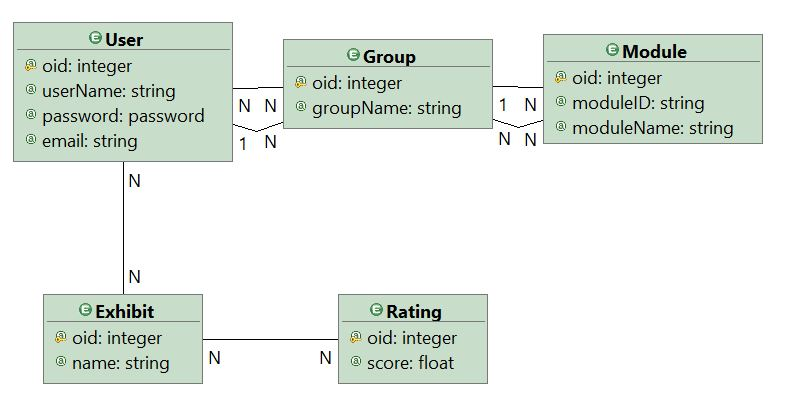
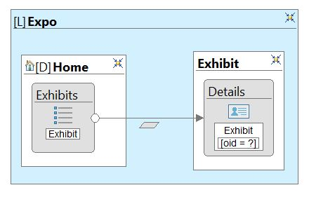
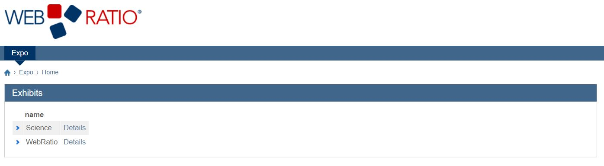
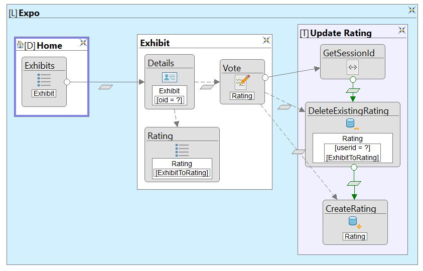
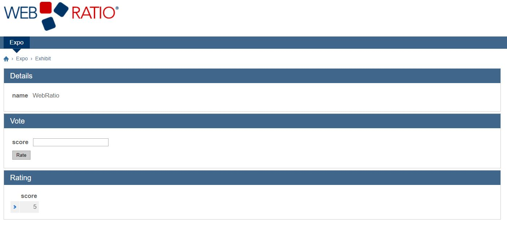

## WebRatio voting web application tutorial

This is a detailed, step-by-step tutorial for creating a simple web application with Model Driven Development using the WebRatio platform.

This tutorial should work for Windows users, but as of today we have not been able to run WebRatio on Mac.

The final application that will be made in this tutorial is also available in this repository.

---
1. **Setup**
    - Download the WebRatio Web Platform Community Edition for windows: https://www.webratio.com/site/content/en/editions#wr-web-platform
        - There is a requirement of an account on WebRatio to download and login when opening the program for the first time
    - Run the *.exe* file to install, then open the program when it is done

2. **Project Setup**
    - Click on *File* -> *New* -> *Web project* to create a new project
        - Give the project a name (like *Expo*)
        - Should now have new project with a *Model.wr* file and domain model looking like this:
     
    - Right click in *outline* window for the domain model, go to *add* and then select *Database* to create a new database
    - Click on the database and go to the *properties window* (bottom left)
        - Select type: *Apache derby*
        - Add to URL: jdbc:derby://localhost:50124/*Your_DB_Name_Here*;create=true
        - Add "admin" as username and password
 

3. **Create domain model**
    **NB! The naming in this part is crucial if we want to avoid having to make changes to the SQL script manually**
    - Navigate to the *Domain model* window
        - Click on *Entity* and add a new entity (green circle with an *E* inside)
        - Call the new entity *Exhibit*
        - Right click on *Exhibit* entity -> *add* -> *attribute* and add a new attribute called "name" of type string
        - Click on *Relationship* and add a new relationship between *Exhibit* and *User* (brown circle with an R inside)
    - Repeat above steps to create a new entity called *Rating* with an attribute "score" of type float, an attribute calles userid of type string and a relationship between *Exhibit* and *Rating*

The resulting domain model should look something like this:

4. **Initialize Database**
    - Right click on your database and click on *Synchronize* 
        - Select *App* as schemata and hit *Next*
        - Click on *Export all objects* (rightmost button above window) and hit *Next*
        - Now you have created a SQL script for initializing the DB, make sure *Save and execute* is checked and hit finish
        - Should now be able to expand the database in the *Outline* window to view metadata
    - Download or copy *data.sql* from the repository (above)
        - Right click on database and select *Execute SQL*
        - Locate the *data.sql* file and hit *OK*
        - Terminal window at the bottom should say *SQL SCRIPT SUCCESSFULLY EXECUTED*
        - Now we have populated the DB with some dummydata

5. **Create basic view model:** Simple site for viewing the exhibits stored in our DB
    - Click on the *Project* tab to bring up the project in the *Outline* window
    - Right click on *Web Model* and select *Site View* and call it "View" \
**All the different components for creating model can also be found in the toolbar on the left side of the window**
    - **Add area:** Right click in *View* window -> *Add* -> *Area* and call it "Expo"
    - **Add homepage:** Inside *Area*, right click -> *Add* -> *Page* and call it "Home"
    - **Add exhibit list:** Inside *Home* page, right click -> *Add view components* -> *List* and call it "Exhibits"
        - **In properties window:** locate *Entity*, click select, and choose *Exhibit*
        - **In properties window:** locate *Display Attributes*, click on select and check *Name*
    - **Add new page in *Expo* area:** Right click in *Expo* area -> *Add* -> *Page* and call it *Exhibit*
    - **Create exhibit details:** Right click in *Exhibit* page -> *Add view components* -> *Details* and call it "Exhibit"
        - Properties: Add entity *Exhibit*
    - **Create a data flow from *Exhibits* list to *Details*:** Right click on *Exhibits* list -> *Add* -> *Flow* and then click on details
        - Properties: Add name *Details*

This is what the view model should look like:

Now that we have created a view for our application, we can run the program before continuing, to view our list of exhibits.
To run the application: Right click in outline window -> *Generate* -> *Generate and Run* (the first execution will be slow).
A tomcat server terminal window will pop up, before the webpage automatically pops up at the homepage of our application (default port 8080).\
To stop the application, simply close the tomcat terminal window.

This is what the homepage should look like:

6. **Create a system for voting on exhibits**
    This is a more advanced system that will be using a script (*GetSessionId.groovy*) for getting the session id of the user, such that the user only would be able to vote once on each exhibit. 

    - **Create voting form:** Right click in *Exhibit* page -> *Add view components* -> *Form* and call it "Vote"
        - Properties: Add entity *Rating*
        - Right click on form -> *Entity fields wizard*, make sure only *score* is checked and click *Finish*
    - **Create flow from *Details* to *Vote*:** Right click in *Details* -> *Add* -> *Flow* and click on *Vote*
        - Right click on the flow arrow and click on *Parameters Binding...* 
        - Uncheck *Enable default binding*, go to tab *Passing* and check *oid*
    - **Create view to show the votes for the exhibit:** right click in *Exhibit page* -> *Add* -> *List* and call it "Rating"
        - **Properties**: Set entity to *Rating* and display attributes to *score*
        - Right click on *Rating* -> *Add* -> *Relationship Role Condition*
    - **Create flow from *Details* to *Rating*** Right click in *Details* -> *Add* -> *Flow* and click on *Rating*
    - **Create operation group**: Right click in *Expo* area -> *Add* -> *Operation Group* and name it "Update Rating"
    - **Create script component:** Right click in *Update Rating* operation group -> *Add Utility Components* -> *Script* and name it GetSessionId
        - **Properties:** In script file, click on *Browse* and locate the script *GetSessionId.groovy*
    - **Create a delete operation:** Right click in *Update Rating* operation group *Add Operations* -> *Delete* and name it "DeleteExistingRating"
        - **Properties:** Locate Entity, click Select and choose *Rating*
        - Expand *DeleteExistingRating* in *Outline* tab (to the left), locate and delete the *KeyConditon*
        - Right click on *DeleteExistingRating* -> *Attributes Condition* 
            - Name it "UserIdCondition"  
            - **Properties:** Locate attributes, click select and chech the UserId attribute
        - Right click on *DeleteExistingRating* -> *Relationship Role Condition* 
            - Name it "ExhibitToRatingCondition"
            - **Properties:** Locate role, click on Select, choose ExhibitToRating and click ok
    - **Create a create operation:** Right click in *Update Rating* operation group *Add Operations* -> *Create* and name it "CreateRating"
        - **Properties:** Locate entity, click on select, choose *Rating* and click *ok*
    - **Create flow from *Vote* to *GetSessionId* script:** Right click on *Vote* -> *Add* -> *Flow* and click on *GetSessionId*
    - **Create OK-flow from *GetSessionId* to *DeleteExistingRating*:** Right click in *GetSessionId* -> *Add* -> *OK-flow* and click on *DeleteExistingRating*
        - Right click on the flow arrow and click on *Parameters Binding...* 
        - Add *Result* as a Source for *UserIdCondition*
        - Go to *Passing* tab and check *Result*
    - **Create OK-flow from *DeleteExistingRating* to *CreateRating*:** Right click *DeleteExistingRating* -> *Add* -> *OK-flow* and then click on *CreateRating*
        - Right click on the flow arrow and click on *Parameters Binding...* 
        - Add *Result_PASSING* as source for target *userid*
    - **Create flow from *Vote* to *DeleteExistingRating*:** Right click on *Vote* -> *Add* -> *Flow* and then click on *DeleteExistingRating*
        - **Properties:** Locate type and choose *data flow*
        - Right click on the flow arrow and click on *Parameters Binding...* 
        - Add *oid_PASSING* as source to target *ExhibitToRatingCondition*
     - **Create flow from *Vote* to *CreateRating*:** Right click on *Vote* -> *Add* -> *Flow* and then click on *CreateRating*
        - **Properties:** Locate type and choose *data flow*
        - Right click on the flow arrow and click on *Parameters Binding...* 
        - Add *oid_PASSING* as source to target *Exhibit.oid(RatingToExhibit)*
        - Add *Score* as source to target *Score*

This is what the resulting model should look like:

This is what the final exhibit site should look like:

        

